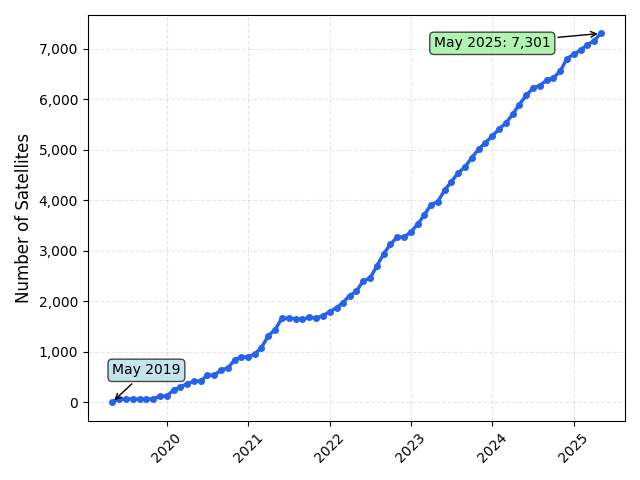
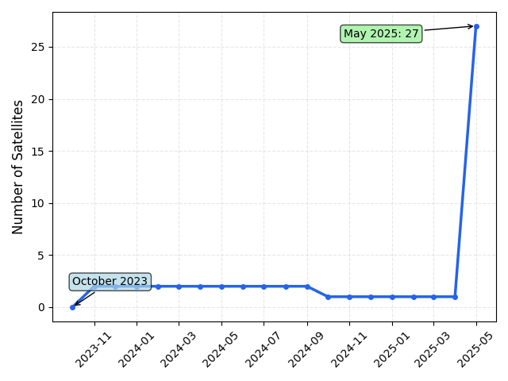
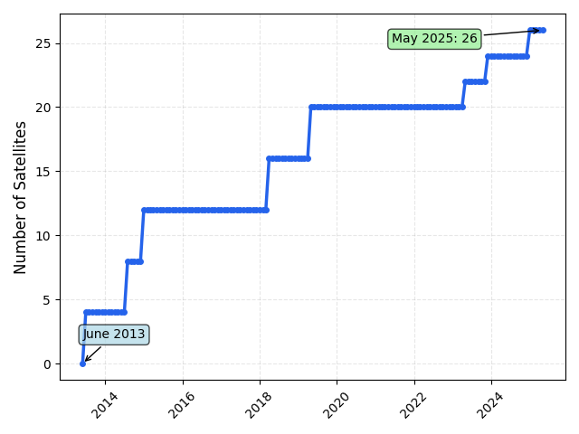
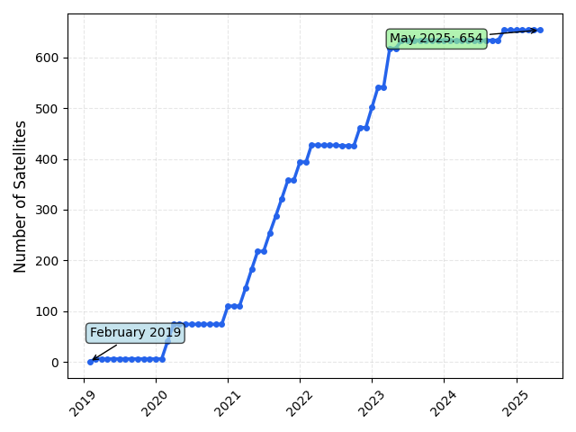

# Starlink Satellite Number Development

Answers the question how many satellites Starlink has in orbit and how the number developed since the initial deployment in May 2019.
Uses data from [Space-Track](https://www.space-track.org).

<table class="tg">
  <tbody>
    <tr>
      <td class="tg-0lax"></td>
      <td class="tg-0lax"></td>
    </tr>
    <tr>
      <td class="tg-0lax">Starlink</td>
      <td class="tg-0lax">Project Kuiper</td>
    </tr>
    <tr>
      <td class="tg-0lax"></td>
      <td class="tg-0lax"></td>
    </tr>
    <tr>
      <td class="tg-0lax">O3B</td>
      <td class="tg-0lax">OneWeb</td>
    </tr>
  </tbody>
</table>


## Citation

```bibtex
@misc{Richter2025,
  title={Starlink Satellite Number Development},
  url={https://github.com/diic-starlink/starlink-satellite-number},
  journal={GitHub}, publisher={Hasso Plattner Institute},
  author={Richter, Robert},
  month={XX},
  year={202X}
} 
```
